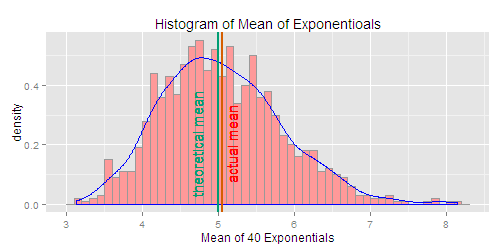
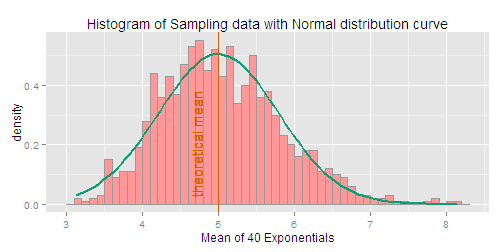

Statistical Inference Project Assignment 1 - Question 1
========================================================

The exponential distribution can be simulated in R with rexp(n, lambda) where lambda is the rate parameter. The mean of exponential distribution is $1/\lambda$ and the standard deviation is also also $1/\lambda$. According to the Central Limit Theorem, The mean or the sum of a random sample of a large enough size  from an arbitary distribution  have **approximately** normal distribution.  

The sample mean $\bar X$ is approximately normal $N(\mu, \sigma^2/n)$  

We generated a thousand simulation of the averages of 40 exponentials where $\lambda$ = **0.2** and the **mean** of the exponentials is equal to $1/\lambda$ which is **5**.

```r
set.seed(10)
lambda = 0.2
nosim <- 1000 #number of simulations
n <- 40 #number of exponential variables
mean_expo <- vector(mode="numeric", length=nosim)
sd_expo <- vector(mode = "numeric", length = nosim)

for(i in 1:nosim){
    sample <- rexp(n,lambda)
    mean_expo[i] <- mean(sample)
    sd_expo[i] <- sd(sample)
}
data <- data.frame(1:nosim, mean_expo, sd_expo)
```

### 1. We show where the distribution is centered at and compare it to the theoretical center of the distribution. 


From the properties of the normal distribution which is a symmetrical distribution, it means that median is equal to mean.


```r
mean_data<- mean(data$mean_expo) #calculate mean of the samples
median_data <- median(data$mean_expo) #calculate median
print(paste("The mean of this sampling is", round(mean_data,3),",the median of the sampling is", round(median_data,3), "and the mean of the exponentials is ", 1/lambda ,sep = " "))
```

```
## [1] "The mean of this sampling is 5.045 ,the median of the sampling is 4.987 and the mean of the exponentials is  5"
```
  
This shows that the mean and median of the distribution of the sampling are almost equal and are close to the mean of the exponential distribution $(1/\lambda)$ which is 5. So we can say that this distribution is **centered**.  

We also shows the distribution in the following graph:

```r
library(ggplot2)
ggplot(data, aes(x=mean_expo))+
    geom_histogram(binwidth = .1,aes(y = ..density..),colour="#999999", fill="#FF9999")+
    geom_density(color = "blue") +xlab("Mean of 40 Exponentials") + 
    ggtitle("Histogram of Mean of Exponentioals") + 
    geom_vline(xintercept=mean_data,color="#D55E00", size = 1.0) +
    geom_text(aes(x=mean_data, label="\nactual mean", y=0.2), vjust = 0.5, colour="red", angle=90)+
    geom_vline(xintercept = 1/lambda, color = "#009E73", size =1.0)+
    geom_text(aes(x=1/lambda, label="\ntheoretical mean", y=0.2), vjust = -0.5,colour="#009E73", angle=90)
```

 

This graph shows that actual mean of the sampling data (red line) is close to the theoretical mean (green line).

## 2. We show how variable it is and compare it to the theoretical variance $1/(n\lambda^2)$ of the distribution.

```r
Sample_SD <- mean(data$sd_expo) #get the sample standard deviation
variance_data <- (Sample_SD^2/n) #variance of the samples
theoretical_variance <- 1/(lambda^2*n) #theoretical variance
print(paste("Variance of the sampling is",round(variance_data,3), "and theoretical variance is",theoretical_variance, ",which are really close.", sep = " "))
```

```
## [1] "Variance of the sampling is 0.61 and theoretical variance is 0.625 ,which are really close."
```

## 3. We show that the distribution is approximately normal or not.

```r
ggplot(data,aes(x = mean_expo)) +
    geom_histogram(binwidth = 0.1,aes(y = ..density..), fill = "#FF9999", colour ="#999999") + 
    xlab("Mean of 40 Exponentials")+
    stat_function(fun=dnorm,colour = "#099E73",size = 1.0,arg = list(mean = 1/lambda,sd = 1/(lambda*sqrt(n))))+
    geom_vline(xintercept = 1/lambda, color = "#D55E00", size =0.5)+
    geom_text(aes(x=1/lambda, label="\ntheoretical mean", y=0.2), vjust = -0.5,colour="#D55E00", angle=90)+
    ggtitle("Histogram of Sampling data with Normal distribution curve")
```

 

From this graph, it shows the sampling data with the Normal distribution curve N($1/\lambda$, $1/(n\lambda^2)$) (green line)  and we can say that the sample data is quite close to be approximated as normal distribution.

### 4. We evaluate the %95 coverage of the confidence interal $\bar X \pm 1.96 S /\sqrt{n}$ where $S$ is the sample standard deviation.

```r
coverage95 <- round(mean_data +c(-1,1)*1.96 * (Sample_SD)*sqrt(1/n),4)
print(paste("The 95% coverage of the confidence interval are", coverage95[1], "and", coverage95[2], sep = " "))
```

```
## [1] "The 95% coverage of the confidence interval are 3.514 and 6.5761"
```

We check if this values are true for this example by showing that 95% of the data are in between the covarage value.

```r
norm_coverage <- subset(data, mean_expo > coverage95[1] & mean_expo < coverage95[2])
check_coverage <-nrow(norm_coverage)/nosim*100 #number should be around 0.95
print(paste("In this case, it actually covers ", check_coverage, "% of the data", sep = ""))
```

```
## [1] "In this case, it actually covers 95.3% of the data"
```
