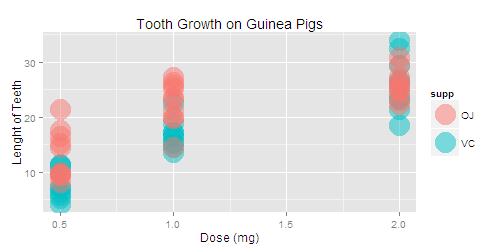

Statistical Inference Project Assignment 1 - Question 2
========================================================
We're going to analyze the ToothGrowth data in the R datasets package. 

The response is the length of odontoblasts (teeth) in each of 10 guinea pigs at each of three dose levels of Vitamin C (0.5, 1, and 2 mg) with each of two delivery methods (orange juice **(OJ)** or ascorbic acid **(VC)**). 
For more information: http://stat.ethz.ch/R-manual/R-devel/library/datasets/html/ToothGrowth.html  

## 1.Load the ToothGrowth data and perform some basic exploratory data analyses 

```r
data(ToothGrowth) #load data ToothGrowth
head(ToothGrowth) 
```

```
##    len supp dose
## 1  4.2   VC  0.5
## 2 11.5   VC  0.5
## 3  7.3   VC  0.5
## 4  5.8   VC  0.5
## 5  6.4   VC  0.5
## 6 10.0   VC  0.5
```

```r
library(ggplot2)
ggplot(ToothGrowth, aes(x=dose,y =len, color = supp))+
    ylab("Lenght of Teeth")+
    xlab("Dose (mg)")+
    geom_point(alpha = 0.5, size = 10)+
    ggtitle("Tooth Growth on Guinea Pigs")
```

 


From the graph, at dose = 0.5 and 1.0, It looks like OJ has more impact on the length of the tooth growth than VC. However, it's hard to tell when dose = 2.0.


## 2.Provide a basic summary of the data.

```r
summary(ToothGrowth)
```

```
##       len       supp         dose     
##  Min.   : 4.2   OJ:30   Min.   :0.50  
##  1st Qu.:13.1   VC:30   1st Qu.:0.50  
##  Median :19.2           Median :1.00  
##  Mean   :18.8           Mean   :1.17  
##  3rd Qu.:25.3           3rd Qu.:2.00  
##  Max.   :33.9           Max.   :2.00
```


Let's take a look at **means** for different supplements and doses.

```r
library(plyr)
m_TG <- ddply(ToothGrowth, .(supp,dose), function(df) mean(df[,1])) #group mean
print(m_TG)
```

```
##   supp dose    V1
## 1   OJ  0.5 13.23
## 2   OJ  1.0 22.70
## 3   OJ  2.0 26.06
## 4   VC  0.5  7.98
## 5   VC  1.0 16.77
## 6   VC  2.0 26.14
```

This shows that the mean of the length of the tooth growth for OJ at dose 0.5 and 0.1 are higher than those for VC. At dose = 2.0, both means are not much different. Also, for each supplement, as the dose levels increase, the lenghts of the tooth also increase.

Now we look at the **standard deviations** for different supplements and doses.

```r
SD_TG <- ddply(ToothGrowth, .(supp,dose), function(df) sd(df[,1])) #group variance
print(SD_TG)
```

```
##   supp dose    V1
## 1   OJ  0.5 4.460
## 2   OJ  1.0 3.911
## 3   OJ  2.0 2.655
## 4   VC  0.5 2.747
## 5   VC  1.0 2.515
## 6   VC  2.0 4.798
```

From the SD table, comparing SD from OJ, the SDs of the tooth growth decrease as while dose levels increase. However, when we compare SD from VC, the SDs of the tooth growth increase as the dose leves increase.

## 3.Use confidence intervals and hypothesis tests to compare tooth growth by supp and dose. (Use the techniques from class even if there's other approaches worth considering)

Since the each test was performed on a group of 10 guinea pigs, we will perform non-paired t test and assume unequal variance as we are not sure if the quinea pigs are from the same population.

We want to compare the means of the tooth growth from OJ and VC for each dose level.
Let $\mu_{oj}$ is the mean of the tooth growth from OJ and $\mu_{vs}$ is the mean of the tooth growth from VC.  
### Hypothesis 1: Test on equality between OJ and VC for each dosage
$H_0: \mu_{oj} - \mu_{vc}$   = 0  
$H_a: \mu_{oj} - \mu_{vc}$   $\neq$ 0  
- Compare at dose 0.5, 

```r
TG05 <- subset(ToothGrowth, dose == 0.5)
t.test(len ~ supp, paired = FALSE, var.equal = FALSE, data = TG05)
```

```
## 
## 	Welch Two Sample t-test
## 
## data:  len by supp
## t = 3.17, df = 14.97, p-value = 0.006359
## alternative hypothesis: true difference in means is not equal to 0
## 95 percent confidence interval:
##  1.719 8.781
## sample estimates:
## mean in group OJ mean in group VC 
##            13.23             7.98
```
It shows that at dose = 0.5, p-value is very small (less than 0.05) then the null hypothesis is rejected. This means the mean of the tooth growth from orange Juice is different from ascorbic acid.
- Compare at dose 0.1, 

```r
TG1 <- subset(ToothGrowth, dose == 1)
t.test(len ~ supp, paired = FALSE, var.equal = FALSE, data = TG1)
```

```
## 
## 	Welch Two Sample t-test
## 
## data:  len by supp
## t = 4.033, df = 15.36, p-value = 0.001038
## alternative hypothesis: true difference in means is not equal to 0
## 95 percent confidence interval:
##  2.802 9.058
## sample estimates:
## mean in group OJ mean in group VC 
##            22.70            16.77
```
It shows that at dose = 1.0, p-value is very small (less than 0.05) then the null hypothesis is rejected. This means the mean of the tooth growth from orange Juice is different from ascorbic acid.

```r
TG2 <- subset(ToothGrowth, dose == 2)
t.test(len ~ supp, paired = FALSE, var.equal = FALSE, data = TG2)
```

```
## 
## 	Welch Two Sample t-test
## 
## data:  len by supp
## t = -0.0461, df = 14.04, p-value = 0.9639
## alternative hypothesis: true difference in means is not equal to 0
## 95 percent confidence interval:
##  -3.798  3.638
## sample estimates:
## mean in group OJ mean in group VC 
##            26.06            26.14
```

For this case p-value is greater than 0.05 then we can accept the null hypothesis that there is no different on the mean of tooth growth from both supplement at dose = 2.0

### Hypothesis 2: Test if OJ has more impact on VC for each dosage
$H_0: \mu_{oj} - \mu_{vc}$   $\leq$ 0  
$H_a: \mu_{oj} - \mu_{vc}$   > 0  

- Compare at dose 0.5, 

```r
t.test(len ~ supp, alternative = "greater", paired = FALSE, var.equal = FALSE, data = TG05)
```

```
## 
## 	Welch Two Sample t-test
## 
## data:  len by supp
## t = 3.17, df = 14.97, p-value = 0.003179
## alternative hypothesis: true difference in means is greater than 0
## 95 percent confidence interval:
##  2.346   Inf
## sample estimates:
## mean in group OJ mean in group VC 
##            13.23             7.98
```

It shows that at dose = 0.5, p-value is very small (less than 0.05) then the null hypothesis is rejected. This means orange Juice has more impact on tooth growth than ascorbic acid.  
- Compare at dose 1.0, 

```r
t.test(len ~ supp, alternative = "greater", paired = FALSE, var.equal = FALSE, data = TG1)
```

```
## 
## 	Welch Two Sample t-test
## 
## data:  len by supp
## t = 4.033, df = 15.36, p-value = 0.0005192
## alternative hypothesis: true difference in means is greater than 0
## 95 percent confidence interval:
##  3.356   Inf
## sample estimates:
## mean in group OJ mean in group VC 
##            22.70            16.77
```

It shows that at dose = 1.0, p-value is again very small (less than 0.05) then the null hypothesis is rejected.  
- Compare at dose 2.0, 

```r
t.test(len ~ supp, alternative = "greater", paired = FALSE, var.equal = FALSE, data = TG2)
```

```
## 
## 	Welch Two Sample t-test
## 
## data:  len by supp
## t = -0.0461, df = 14.04, p-value = 0.5181
## alternative hypothesis: true difference in means is greater than 0
## 95 percent confidence interval:
##  -3.133    Inf
## sample estimates:
## mean in group OJ mean in group VC 
##            26.06            26.14
```
For this case p-value is greater than 0.05 then we cannot reject the null hypothesis.So we cannot tell that OJ has more impact than VC  

## 4.State your conclusions and the assumptions needed for your conclusions. 

We can conclude that orange Juice has more impact on that tooth growth than ascorbic acid when dose is less or equal to 1.0, however when dose = 2.0, there is no different on the toothgrowth from both orange juice and ascorbic acid.
